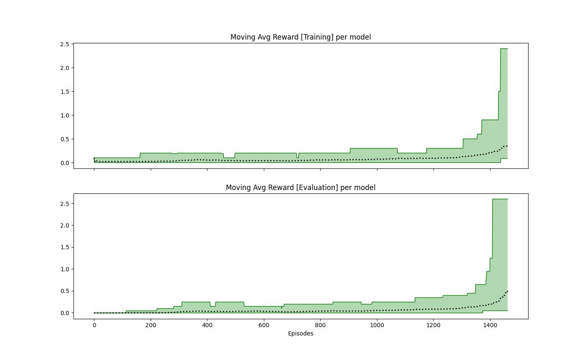
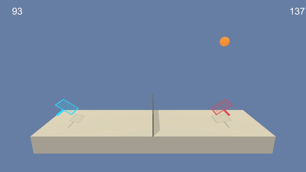
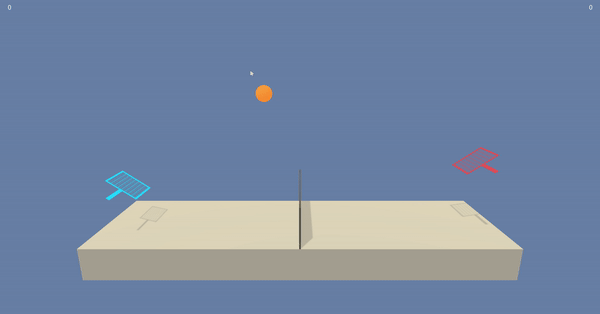

### Report
The goal of this project was to solve the Tenis unity environment using multi agent RL. Two agents are controlling rackets to put a ball over the net. Each agent:
1) A local observation that is continuous of 24 dimension equivalent to the position and velocity of the ball and racket. 
2) Can control the movement of the racket towards the net and also jump using a 2 dimensional vector that is continuous. The reward is either +0.1 for hitting the ball over the net and -0.01 for letting the ball touch the ground or go out of bounds. 

The task is solved when the average score (over 100 episode) is above 0.5. The score for each episode is the maximum of the undiscounted reward of each agent. 

### Agent Design

The approach stems from the [Multi Agent Deep Determinstic Policy Gradients](https://arxiv.org/pdf/1509.02971.pdf). With MADDPG they use centralized training and decentralized execution in that the critic has infomation about all states and actions while policy only stores the an agents state and/or actions. This attempt was successful but it took a long time to stabilize and reach the target of 0.5 over 100 episodes.

On a second approach, we decentralized the training and execution. Each critic and actor only had information pertaining to the current agent. There was an increase in average score and simulation run-time.

The benefit of using the soft actor critic method (SAC) is that we can maximize the agent reward, and entropy which helps sample efficiency. Also, we used a replay buffer that starts of with uniform sampling and changes to priroty based sampling once we have enough experience stored in the buffer. 

### Model Information
Seven different networks were used:
1) Four for estimating the state value given states and action vectors. 
     ```
     online_value_model_a
     target_value_model_a
     online_value_model_b
     target_value_model_b
     ```
2) Two for estimating the state value given states only. For calculating the advantage
     ```
     online_state_model_v
     target_state_model_v
     ```
3) One function for predicting the actions to take: For calculating the advantage
     ```
     policy_model
     ```
For more information on how the models work, the **Env_Agent_Interact** script annotates the steps.

### Parameters

All networks were trained with adam optimizers using the same learning rate of 5e-4 and a batch size of 1024. The parameters used are describe in the table below. 

```
    # current seed parameter
    seed = 12

    # information for actor [action prediction]
    policy_info = {"hidden_dims":[256, 256],
                   "learning_rate":0.0005,
                   "max_grad_norm":float("inf")}

    # information for critics and state value estimators
    value_info = {"hidden_dims":[256, 256],
                  "learning_rate":0.0005,
                  "max_grad_norm":float("inf")}

    # general training information
    training_info = {"update_every_steps": 1,
                     "n_warmup_batches": 2,
                     "weight_mix_ratio": 0.005}

    # environment information
    env_info = {"gamma": 0.95,
                "max_minutes": 300,
                "max_episodes": 2000,
                "goal_mean_100_rewards": 0.5}
        
    # replay buffer storage
    buffer_info = {"capacity":100000,
                   "batch_size": 1024}

    # number of training checkpoints to be saved 
    checkpoints = 4

    # results storage folder location
    result_storage = "results"

    # number of times we sample the memory buffer per update step
    optim_iter = 1 
```

### Results

We were able to get an average score (over 100 episode) of 0.5 in about 1462 episodes. 
<p align="center">

</p>

During training stage reward was tracked using the maximum reward from either agent during an episode. However, during evaluation, the average of both agents was the reward marker. The graph of the result is shown below. The black dotted line shows the average reward per episode and green area shows max and min per 100 episodes.

<p align="center">

</p>
The saved weights can be found in the results checkpoint directory. 

Gif of the agent halfway through the training cycle:
<p align="center">

</p>

And when fully trained:
<p align="center">

</p>

When evaluated on the Fully trained agent, we achieved a score of 2.38 with a standard deviation of 0.76

### Credit
Most of the code structure for SAC followed this projects [here](https://github.com/mimoralea/gdrl/blob/master/notebooks/chapter_12/chapter-12.ipynb)